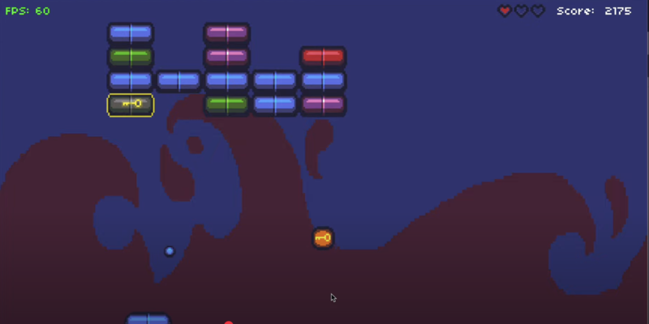

# Breakout

A LÖVE2D remake of the classic Breakout game with levels, powerups, particle effects, and arcade-style scoring. Built for CS50's Game Development course.



## Description

Breakout is a block-breaking game where you control a paddle and bounce a ball to destroy bricks. This project explores more complex game development concepts including:

- Collision detection with multiple object types
- Ball reflection based on angle of contact
- Paddle and powerup upgrades
- State-driven menu and game flow
- Persistent high score tracking

## How to Play

### Controls

- `Left Arrow`: Move paddle left  
- `Right Arrow`: Move paddle right  
- `Enter`: Confirm / Start game  
- `P`: Pause the game  

### Objective

Break all the bricks without letting the ball fall past your paddle. Collect powerups to gain extra lives or multi-ball abilities. Reach higher levels with tougher layouts!

## Development

### Built With

- [LÖVE2D](https://love2d.org/) — 2D game framework
- Lua — Programming language
- Object-oriented programming via `class.lua`
- State machine architecture for handling gameplay logic

### Project Structure

- `main.lua` — Entry point and game loop
- `src/` — Core game logic, states, and entities
- `graphics/` — Sprites and textures
- `fonts/` — Game font(s)
- `sounds/` — SFX and music
- `lib/` — External libraries like `push` and `class`

## Installation and Running

1. [Download and install LÖVE2D](https://love2d.org/)
2. Clone the repository:
   ```bash
   git clone https://github.com/ethanperello/breakout.git
   ```
3. Run the game:
   ```bash
   love breakout
   ```

## Demo

[Watch the gameplay demo](https://www.youtube.com/watch?v=sVcEJVXvUBk&t=76s)

## Credits

- Developed by Ethan Perello  
- Created as part of CS50's Game Development course  
- Sound and sprite assets inspired by classic arcade Breakout games
